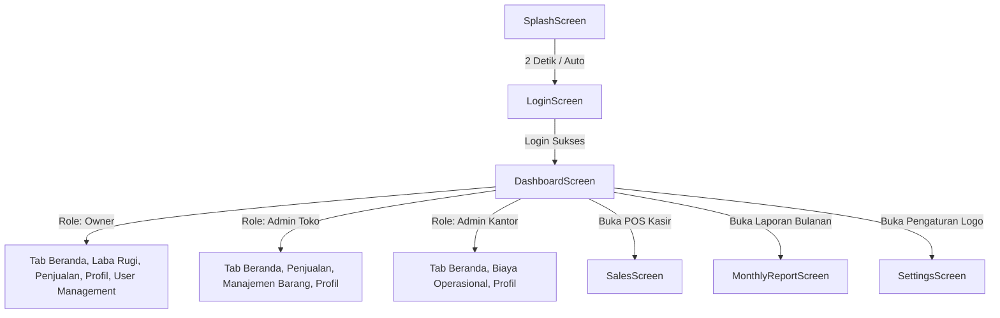

# Dokumentasi Halaman & Form - Manajemen Warung FE

Dokumen ini merinci seluruh **halaman (screen)**, **tab composable**, **formulir input (form)**, **komponen UI**, **dialog modal**, serta **hak akses pengguna (role-based access control)** yang ada di dalam aplikasi Android Manajemen Warung FE.

---

## 1. Ikhtisar Struktur & Rute Navigasi Aplikasi

Navigasi utama dikelola menggunakan Jetpack Compose Navigation pada file [`AppNavigation.kt`](file:///home/padikering/Documents/KERJA/manajemen-warung-fe/app/src/main/java/com/example/navigation/AppNavigation.kt):

### Tabel Rute Navigasi & Hak Akses

| Rute / Nav Destination | Layar / File Sumber | Hak Akses Role | Deskripsi Singkat |
| :--- | :--- | :--- | :--- |
| `splash` | [`SplashScreen.kt`](file:///home/padikering/Documents/KERJA/manajemen-warung-fe/app/src/main/java/com/example/ui/screens/SplashScreen.kt) | Publik (Semua) | Tampilan animasi pembuka / splash screen aplikasi |
| `login` | [`LoginScreen.kt`](file:///home/padikering/Documents/KERJA/manajemen-warung-fe/app/src/main/java/com/example/ui/screens/LoginScreen.kt) | Publik (Semua) | Form autentikasi email & kata sandi |
| `dashboard/{role}` | [`DashboardScreen.kt`](file:///home/padikering/Documents/KERJA/manajemen-warung-fe/app/src/main/java/com/example/ui/screens/DashboardScreen.kt) | Terautentikasi | Layar pusat kendali berisi tab dinamis sesuai role |
| `sales` | [`SalesScreen.kt`](file:///home/padikering/Documents/KERJA/manajemen-warung-fe/app/src/main/java/com/example/ui/screens/SalesScreen.kt) | Admin Toko, Owner | Layar kasir (POS) untuk checkout dan cetak struk dapur |
| `monthly_report` | [`MonthlyReportScreen.kt`](file:///home/padikering/Documents/KERJA/manajemen-warung-fe/app/src/main/java/com/example/ui/screens/MonthlyReportScreen.kt) | Owner | Laporan bulanan, ranking menu terlaris, dan rincian harian |
| `settings` | [`SettingsScreen.kt`](file:///home/padikering/Documents/KERJA/manajemen-warung-fe/app/src/main/java/com/example/ui/screens/SettingsScreen.kt) | Owner, Admin Toko, Admin Kantor | Pengaturan logo warung dengan pemotong gambar (crop) |

---

## 2. Rincian Lengkap Halaman & Isi Formulir

---

### 2.1. Layar Splash (`SplashScreen.kt`)
- **Tujuan**: Memberikan sambutan visual saat aplikasi pertama kali dibuka dan melakukan persiapan inisialisasi awal.
- **Hak Akses**: Publik.
- **Komponen & Konten UI**:
  - Logo Ikon Warung (`AppIcons.Store`).
  - Judul Aplikasi: *"Warung Manager"*.
  - Slogan / Tagline: *"Kelola warungmu, raih untungmu"*.
  - Indikator putar loading (*CircularProgressIndicator*).
- **Aksi & Transisi**: Berpindah otomatis setelah penundaan 2 detik menuju rute `login` (dengan `popUpTo("splash") { inclusive = true }`).

---

### 2.2. Layar Login (`LoginScreen.kt`)
- **Tujuan**: Autentikasi pengguna untuk masuk ke sistem sesuai hak akses role.
- **Hak Akses**: Publik.
- **Komponen & Konten UI**:
  - Header bergradasi warna tema dengan ikon toko dan teks judul *"Selamat Datang"*.
  - Kartu Card Form dengan elevasi dan sudut melengkung.
- **Formulir & Field Input**:
  1. **Field Email**:
     - *Komponen*: `OutlinedTextField`
     - *Tipe Input*: Email (`KeyboardType.Email`)
     - *Ikon Depan*: Email Icon
     - *Validasi*: Tidak boleh kosong; menampilkan warna error jika belum diisi.
  2. **Field Password**:
     - *Komponen*: `OutlinedTextField`
     - *Tipe Input*: Password (`KeyboardType.Password`)
     - *Ikon Depan*: Lock Icon
     - *Ikon Belakang*: Tombol toggle lihat/sembunyikan password (*Visibility / VisibilityOff*).
     - *Validasi*: Tidak boleh kosong; menampilkan warna error jika belum diisi.
- **Tombol & Aksi**:
  - **Tombol "Masuk"**:
    - Menjalankan fungsi login via `AuthViewModel.login()`.
    - Menampilkan animasi loading (*CircularProgressIndicator*) di dalam tombol saat request berlangsung.
  - **Notifikasi**: Menampilkan pesan error via `SnackbarHost` jika email/password salah atau server gagal dihubungi.
  - **Navigasi Berhasil**: Mengarahkan pengguna langsung ke `dashboard/{role}` sesuai peran yang dikembalikan backend (`OWNER`, `ADMIN_TOKO`, atau `ADMIN_KANTOR`).

---

### 2.3. Layar Dashboard Utama (`DashboardScreen.kt`)

Layar ini merupakan dashboard dinamis berbasis tab navigation (bawah/samping) yang menyesuaikan konten berdasarkan role pengguna.

#### Pembagian Tab Berdasarkan Role:
- **OWNER**: Beranda, Laba Rugi, Penjualan, Profil, User Management.
- **ADMIN TOKO**: Beranda, Penjualan, Manajemen Barang, Profil.
- **ADMIN KANTOR**: Beranda, Biaya Operasional, Profil.

Berikut adalah rincian masing-masing tab di dalam Dashboard:

---

#### 2.3.1. Tab Beranda (`BerandaTabContent`)
- **Tujuan**: Menampilkan ikhtisar harian status warung, performa penjualan, pengeluaran, dan jalan pintas menu.
- **Hak Akses**: Owner, Admin Toko, Admin Kantor.
- **Komponen & Konten UI**:
  1. **Kartu Sambutan Pengguna**:
     - Menampilkan nama pengguna aktif dan badge role.
     - Tanggal hari ini (format: *Hari, Tanggal Bulan Tahun*).
     - Tombol Logout cepat (khusus Owner).
  2. **Kartu Metrik Finansial Hari Ini**:
     - *Total Omzet Hari Ini*: Nilai rupiah total penjualan berstatus `COMPLETED` setelah dikurangi diskon.
     - *Jumlah Transaksi Berhasil & Dibatalkan*.
     - *Beban Pengeluaran*: Pengeluaran hari ini, minggu ini, dan bulan ini.
  3. **Grid Menu Navigasi Cepat (Quick Shortcut)**:
     - Kartu jalan pintas ke tab-tab lain sesuai izin role pengguna.
  4. **Bagian Antrean Pesanan Berjalan**:
     - Memuat ringkasan pesanan aktif yang siap disajikan atau sedang diproses dapur.
  5. **Daftar Transaksi Terakhir**:
     - Menampilkan riwayat transaksi terkini lengkap dengan waktu dan nilai belanja.

---

#### 2.3.2. Tab Penjualan (`PenjualanTabContent`)
- **Tujuan**: Memantau seluruh riwayat transaksi kasir, filter tanggal, cetak ulang struk, membatalkan transaksi, dan input order cepat.
- **Hak Akses**: Admin Toko, Owner.
- **Komponen & Konten UI**:
  1. **Bar Filter & Pencarian**:
     - *Pilihan Periode*: Hari Ini, Minggu Ini, Bulan Ini, Bulan Lalu, Semua.
     - *Field Search*: Mencari berdasarkan nama item, nama pemesan, atau nomor ID transaksi.
  2. **Kartu Ringkasan**:
     - Menampilkan akumulasi omzet penjualan pada periode filter yang dipilih.
  3. **Daftar Riwayat Penjualan (LazyColumn)**:
     - Menampilkan kartu transaksi: ID transaksi, jam/tanggal, nama pemesan/meja, daftar menu & kuantitas, catatan, total harga, status badge, dan metode pembayaran.
     - Tombol aksi pada tiap item: Detail, Cetak Ulang Struk, Batalkan Transaksi, dan Hapus Permanen (khusus Owner).
- **Formulir & Dialog / Modal**:
  1. **Formulir Input Transaksi Cepat (`showAddForm`)**:
     - *Field Nama Barang*: Input nama makanan/minuman (dengan autocomplete saran barang).
     - *Field Jumlah (Qty)*: Kuantitas barang (angka).
     - *Field Harga Satuan*: Nilai rupiah satuan.
     - *Field Catatan*: Teks catatan khusus (opsional, misal: "tidak pedas").
     - *Field Metode Pembayaran*: Pilihan pembayaran (Tunai, QRIS, Transfer, Belum Lunas).
     - *Field Nama Pelanggan / Meja*: Nama pemesan atau meja.
     - *Tombol Aksi*: "Batal", "Simpan Transaksi".
  2. **Dialog Konfirmasi Pembatalan Transaksi (`showCancelConfirmation`)**:
     - Konfirmasi membatalkan transaksi aktif kasir.
     - Mencatat pembatalan ke backend via API `PATCH /transactions/{id}/cancel`.
  3. **Dialog Konfirmasi Hapus Permanen (`transactionIdToDelete`)**:
     - *Khusus Role Owner*: Menghapus transaksi secara permanen via `DELETE /transactions/{id}`.
  4. **Dialog Cetak Struk Bluetooth / Jaringan (`showPrinterDialog`)**:
     - Pilihan printer thermal Bluetooth terpasang (*paired devices*).
     - Opsi alamat IP & Port untuk printer jaringan lokal (Virtual Thermal Printer / LAN ESC/POS).

---

#### 2.3.3. Tab Manajemen Barang (`BarangTabContent`)
- **Tujuan**: Pengelolaan katalog produk warung (tambah menu, ubah harga, manajemen kategori, susunan tata letak, dan ekspor data).
- **Hak Akses**: Admin Toko (dan Owner).
- **Komponen & Konten UI**:
  - Bar pencarian nama barang.
  - Tab filter kategori (Semua, Makanan, Minuman, Snack, dsb.).
  - Tombol aksi: "Tambah Menu", "Tambah Kategori", "Atur Urutan Tampilan", dan "Ekspor Data".
  - Daftar katalog barang dengan kartu yang menampilkan: nama produk, kategori, harga satuan, tombol edit, dan tombol hapus.
- **Formulir & Dialog / Modal**:
  1. **Formulir Tambah Menu Baru (`showAddMenuForm`)**:
     - *Field Nama Menu*: Teks nama produk makanan/minuman (Wajib).
     - *Field Harga*: Nilai numerik harga jual (Wajib).
     - *Dropdown Kategori*: Memilih kategori yang sudah ada atau memilih kategori kustom.
     - *Tombol Aksi*: "Batal", "Simpan Produk".
  2. **Formulir Edit Menu (`itemToEdit`)**:
     - *Field Nama Menu*: Mengubah nama produk.
     - *Field Harga Menu*: Mengubah harga jual.
     - *Dropdown Kategori*: Mengubah kategori produk.
     - *Tombol Aksi*: "Batal", "Simpan Perubahan".
  3. **Formulir Tambah Kategori Baru (`showAddKategoriModal`)**:
     - *Field Nama Kategori*: Teks nama kategori baru (misal: "Paket Hemat").
     - *Tombol Aksi*: "Batal", "Simpan Kategori".
  4. **Dialog Pengaturan Urutan Tampilan Menu (`showPdfSettingsDialog`)**:
     - Memungkinkan reordering (mengatur urutan tampil) kategori menu dan produk di kasir / daftar cetak katalog.
     - *Tombol Aksi*: "Simpan Urutan" (sinkronisasi ke API layout backend).
  5. **Dialog Konfirmasi Hapus Menu (`itemToDelete`)**:
     - Dialog peringatan sebelum menghapus produk dari inventaris.

---

#### 2.3.4. Tab Laba Rugi (`LabaRugiTabContent`)
- **Tujuan**: Menganalisis kondisi keuangan warung dengan menghitung pendapatan bersih (Pendapatan Kotor dikurangi Beban Operasional).
- **Hak Akses**: Khusus Role `OWNER`.
- **Komponen & Konten UI**:
  1. **Filter Periode Analisis**:
     - Pilihan: Hari Ini, Kemarin, Minggu Ini, Bulan Ini, Bulan Lalu, Semua, dan Pilih Rentang Tanggal (Custom Date Range).
  2. **Kartu Ringkasan Neraca Keuangan**:
     - *Total Pendapatan (Gross Revenue)*: Nilai omzet penjualan bersih.
     - *Total Beban / Pengeluaran (Total Expenses)*: Nilai seluruh biaya operasional pada periode tersebut.
     - *Laba Bersih (Net Profit)*: Nilai laba/rugi dengan indikator visual warna (Hijau jika untung, Merah jika defisit/rugi).
  3. **Rincian Beban per Pos Kategori**:
     - Persentase dan nominal untuk *Bahan Baku*, *Biaya Operasional*, dan *Biaya dll*.
  4. **Breakdown Riwayat Penjualan per Tanggal**:
     - Akordeon (*expandable list*) yang menampilkan rincian omzet per tanggal beserta daftar transaksinya.
  5. **Tombol Navigasi Laporan Bulanan**:
     - Membuka halaman detail [`MonthlyReportScreen.kt`](file:///home/padikering/Documents/KERJA/manajemen-warung-fe/app/src/main/java/com/example/ui/screens/MonthlyReportScreen.kt).

---

#### 2.3.5. Tab Biaya Operasional (`BiayaTabContent`)
- **Tujuan**: Pencatatan segala bentuk beban operasional warung (belanja bahan baku, utilitas/listrik, gaji karyawan, dsb.).
- **Hak Akses**: Admin Kantor (dan Owner).
- **Komponen & Konten UI**:
  - Filter kategori biaya: Semua, Bahan Baku, Biaya Operasional, Biaya dll.
  - Filter rentang tanggal: Hari Ini, Minggu Ini, Bulan Ini, Bulan Lalu, Semua, atau Custom Date Range.
  - Kartu total pengeluaran terfilter.
  - Daftar riwayat pengeluaran operasional (menampilkan tanggal, pos kategori, catatan keterangan, pembuat entri, dan nominal biaya).
- **Formulir & Dialog / Modal**:
  1. **Formulir Tambah Biaya Baru (`showAddForm`)**:
     - *Pilihan Kategori*: Radio button / dropdown ("Bahan Baku", "Biaya Operasional", "Biaya dll").
     - *Field Keterangan*: Deskripsi pos pengeluaran (misal: "Beli beras 25kg, minyak 5L").
     - *Field Jumlah (Nominal)*: Nilai rupiah pengeluaran (numerik).
     - *Field Tanggal*: Tanggal pengeluaran (otomatis tanggal hari ini atau dapat dipilih manual).
     - *Field Pembuat*: Otomatis terisi nama pengguna login yang mencatat.
     - *Tombol Aksi*: "Batal", "Simpan Biaya".
  2. **Formulir Edit Biaya (`itemToEdit`)**:
     - Mengubah kategori, keterangan, nominal, dan tanggal biaya yang sudah ada.
     - *Tombol Aksi*: "Batal", "Perbarui Biaya".
  3. **Dialog Konfirmasi Hapus Biaya (`itemToDelete`)**:
     - Peringatan konfirmasi sebelum data pengeluaran dihapus permanen.
  4. **Dialog Pemilih Rentang Tanggal (`showDateRangePicker`)**:
     - Modal kalender Material3 untuk memilih tanggal mulai (*start date*) dan tanggal selesai (*end date*).

---

#### 2.3.6. Tab Profil (`ProfilTabContent` / `ProfileScreen.kt`)
- **Tujuan**: Manajemen akun pengguna aktif dan pengaturan identitas fisik toko/warung.
- **Hak Akses**: Owner, Admin Toko, Admin Kantor.
- **Komponen & Konten UI**:
  - Avatar lingkaran profil pengguna.
  - Kartu info akun: Nama pengguna, email terdaftar, dan badge role.
- **Formulir & Dialog / Modal**:
  1. **Formulir Ubah Nama Pengguna**:
     - *Field Nama Akun*: Input teks nama tampilan baru.
     - *Tombol Aksi*: "Simpan Nama" (memperbarui nama ke server via API `PUT /api/v1/users/me`).
  2. **Formulir Pengaturan Identitas Warung (Store Profile)**:
     - Informasi ini digunakan sebagai header kop struk belanja dan kop surat penawaran (*Quotation PDF*).
     - *Field Nama Warung*: Nama usaha toko/warung (Wajib).
     - *Field Alamat Warung*: Alamat fisik toko (Maksimal 100 karakter).
     - *Field Email Kontak*: Email resmi toko (Validasi format email regex).
     - *Tombol Aksi*: "Simpan Profil Warung" (mengirimkan data via API `PUT /api/v1/settings/warung` dan `SharedPreferences`).
     - *Tombol Reset*: Mengembalikan nilai formulir ke data tersimpan.
  3. **Menu Tindakan Lainnya**:
     - Tombol navigasi ke *Pengaturan Logo Warung* (`SettingsScreen`).
     - Tombol Bantuan / Panduan Sistem.
     - Tombol Logout dengan dialog konfirmasi keluar.

---

#### 2.3.7. Tab Manajemen Pengguna (`UserManagementTabContent` / `UserManagementScreen.kt`)
- **Tujuan**: Mengelola daftar akun kasir dan staf yang memiliki akses ke aplikasi.
- **Hak Akses**: Khusus Role `OWNER`.
- **Komponen & Konten UI**:
  - Daftar kartu pengguna sistem menampilkan: Nama Lengkap, Username, Email, dan Role (Badge: *Admin Toko, Admin Kantor, Owner*).
  - Tombol edit akun pada tiap kartu user.
- **Formulir & Dialog / Modal**:
  1. **Formulir Edit Pengguna (`displayEditDialog`)**:
     - *Field Nama Baru*: Nama lengkap pengguna (Wajib, validasi tidak boleh kosong).
     - *Field Email Baru*: Alamat email pengguna.
     - *Field Password Baru (Opsional)*: Digunakan jika owner ingin me-reset kata sandi akun karyawan.
     - *Tombol Aksi*: "Batal", "Simpan" (mengirim perubahan ke server via API `PUT /api/v1/users/{id}`).

---

### 2.4. Layar Antrean Pesanan Aktif (`ActiveOrdersScreen.kt`)
- **Tujuan**: Layar monitoring pesanan berjalan untuk pelayan dan dapur (*Kitchen Display & Order Tracker*).
- **Hak Akses**: Admin Toko, Owner.
- **Komponen & Konten UI**:
  1. **Bar Status Pesanan & Polling Realtime**:
     - Filter chip status: *Semua*, *PENDING* (Menunggu Masak), *READY* (Siap Saji), *COMPLETED* (Selesai).
     - Polling otomatis data pesanan setiap 10 detik dari server.
     - Tombol refresh manual.
  2. **Kartu Pesanan Berjalan**:
     - Header kartu: Nomor Transaksi, jam pesan, dan nama pemesan / nomor meja.
     - Daftar Item Makanan/Minuman:
       - Nama menu, kuantitas order, dan harga.
       - *Kontrol Porsi Tersaji (Served Qty)*: Tombol (+) dan (-) untuk mencatat berapa porsi yang sudah selesai dimasak dan disajikan oleh staf dapur.
       - Tombol edit kuantitas item pesanan.
       - Tombol hapus baris item dari pesanan aktif.
- **Formulir & Dialog / Modal**:
  1. **Formulir Tambah Item ke Pesanan Aktif (`showAddItemDialog`)**:
     - Digunakan saat pelanggan ingin menambah menu baru ke orderan yang sedang berjalan.
     - *Field Pencarian Menu*: Autocomplete katalog menu.
     - *Field Kuantitas*: Jumlah item tambahan.
     - *Tombol Aksi*: "Batal", "Tambahkan ke Pesanan".
  2. **Formulir Pelunasan / Selesaikan Pesanan (`showCompleteDialog`)**:
     - *Ringkasan Tagihan*: Subtotal belanja dan total yang harus dibayar.
     - *Field Diskon*: Diskon nominal (Rp) atau persen (%).
     - *Pilihan Metode Pembayaran*: Cash / Tunai, QRIS, Transfer Bank, Debit.
     - *Field Uang Diterima & Kembalian*: Menghitung kembalian uang pelanggan secara otomatis.
     - *Tombol Aksi*: "Selesaikan Pembayaran & Cetak Struk".
  3. **Dialog Konfirmasi Pembatalan Pesanan (`showCancelDialog`)**:
     - Input alasan pembatalan dan membatalkan pesanan di backend.
  4. **Fitur Ekspor Surat Penawaran (Quotation PDF)**:
     - Menghasilkan dokumen resmi penawaran harga (*Quotation PDF*) berbasis data orderan aktif.

---

### 2.5. Layar Kasir / Point of Sale POS (`SalesScreen.kt`)
- **Tujuan**: Antarmuka cepat kasir untuk mencatat pesanan baru pelanggan di kasir depan, memasukkan ke keranjang, dan mencetak struk dapur.
- **Hak Akses**: Admin Toko, Owner.
- **Komponen & Konten UI**:
  1. **Header Kasir**:
     - Tombol kembali ke dashboard.
     - Judul *"Kasir / Penjualan Baru"*.
  2. **Formulir Input Pesanan Cepat**:
     - *Field Nama Pelanggan / Nomor Meja*: Teks nama pemesan (Wajib diisi sebelum order dapat diproses).
     - *Field Bar Pencarian Menu (Autocomplete)*:
       - Mengetik minimal 2 huruf akan memunculkan dropdown menu yang cocok.
       - Memilih item otomatis mengisi nama dan harga satuan standar.
     - *Field Kuantitas (Qty)*: Kuantitas barang (default: "1") dengan kontrol tombol.
     - *Field Harga Satuan*: Nilai rupiah satuan (dapat disesuaikan jika ada harga khusus).
     - *Tombol "Tambah ke Keranjang"*: Menambahkan item ke daftar keranjang belanja.
  3. **Tabel Keranjang Belanja (Cart Section)**:
     - Daftar item belanjaan saat ini: Nama menu, Qty, harga satuan, dan subtotal harga per baris.
     - Tombol hapus (*Delete Icon*) untuk membuang item dari keranjang.
  4. **Ringkasan Total & Aksi Checkout**:
     - Menampilkan format rupiah besar untuk *Total Harga Belanja*.
     - *Tombol "Buat Pesanan & Cetak Dapur"*:
       - Dinonaktifkan jika keranjang kosong atau nama pemesan belum diisi.
       - Menyimpan transaksi dengan status `PENDING` dan metode pembayaran `BELUM LUNAS` ke sistem.
       - Membuka pratinjau struk dapur.
- **Dialog & Aksi Percetakan (Printing)**:
  1. **Dialog Pratinjau Struk Dapur (`showReceiptDialog`)**:
     - Tampilan format struk teks berfont Monospace standar 58mm / 80mm.
     - Header nama warung, nomor meja, jam, daftar pesanan dapur.
     - Tombol "Cetak Struk": Memeriksa izin Bluetooth dan langsung mencetak ke printer thermal aktif.
     - Tombol "Selesai": Mereset form kasir dan mengosongkan keranjang belanja.
  2. **Dialog Pemilihan Printer Thermal Bluetooth (`showPrinterDialog`)**:
     - Menampilkan daftar perangkat printer thermal Bluetooth yang terpasang (*paired devices*).
     - Menyimpan printer yang dipilih ke preferensi lokal (`last_printer_mac`).
  3. **Dialog Printer Jaringan Lokal (Virtual / Network Printer)**:
     - Mengatur alamat IP printer thermal LAN / Emulator (default: `10.0.2.2`).

---

### 2.6. Layar Pengaturan Logo (`SettingsScreen.kt`)
- **Tujuan**: Mengubah gambar logo warung yang akan dicetak pada struk thermal dan dokumen ekspor.
- **Hak Akses**: Owner, Admin Toko, Admin Kantor.
- **Komponen & Konten UI**:
  - Header dengan tombol kembali.
  - Tampilan gambar pratinjau logo saat ini dalam bingkai lingkaran besar.
  - Pesan panduan: *"Pilih gambar logo dari galeri untuk dipasang pada kop struk & laporan."*
- **Formulir & Integrasi Pemotong Gambar (UCrop)**:
  - **Tombol "Pilih Gambar dari Galeri"**:
    - Membuka galeri foto perangkat via `ActivityResultContracts.GetContent()`.
  - **Layar Pemotong Gambar (UCrop)**:
    - Membuka editor crop gambar dengan rasio 1:1 (*Circular Crop*).
    - Format kompresi bitmap PNG beresolusi optimal (500x500 px).
  - **Penyimpanan Lokal**:
    - Gambar yang telah dipotong disimpan ke direktori internal aplikasi via `LogoManager.saveLogo()`.
    - Menampilkan notifikasi bahwa logo berhasil diperbarui.

---

### 2.7. Layar Laporan Bulanan (`MonthlyReportScreen.kt`)
- **Tujuan**: Menyajikan rekapitulasi data penjualan bulanan secara komprehensif untuk evaluasi performa bisnis warung.
- **Hak Akses**: Khusus Role `OWNER`.
- **Komponen & Konten UI**:
  1. **Header & Filter Periode**:
     - Tombol kembali ke dashboard laba rugi.
     - Dropdown pemilih bulan (Januari s/d Desember) dan pemilih tahun.
  2. **Kartu Ringkasan Kinerja Bulanan**:
     - *Total Order*: Akumulasi jumlah nota/transaksi yang sukses pada bulan terpilih.
     - *Total Penjualan Kotor (Omzet)*: Nilai rupiah pendapatan bulanan.
     - *Rata-rata Penjualan per Order*: Nilai rata-rata per transaksi belanja (*Average Order Value*).
  3. **Bagian Menu Terlaris (Top Selling Menu)**:
     - Daftar ranking menu dengan jumlah porsi terbanyak yang terjual.
     - Menampilkan: Peringkat (1, 2, 3...), nama barang, total porsi terjual (Qty), dan total kontribusi omzet barang tersebut.
  4. **Tabel Rincian Penjualan Harian**:
     - Daftar kalender harian (tanggal 1 sampai dengan akhir bulan).
     - Menampilkan rekapitulasi jumlah transaksi dan total rupiah penjualan pada masing-masing hari.
  5. **Tombol Cetak / Ekspor Laporan**:
     - Fitur ekspor ringkasan performa bulanan ke file laporan eksternal.

---

## 3. Matriks Komponen Formulir Berdasarkan Halaman

Tabel berikut merangkum seluruh formulir, field input, dan jenis kontrol yang ada di seluruh aplikasi:

| Nama Formulir / Dialog | Lokasi Layar / Tab | Komponen / Kontrol Input | Validasi Data |
| :--- | :--- | :--- | :--- |
| **Form Login** | `LoginScreen.kt` | Email TextField, Password TextField (Visibility toggle) | Email & password tidak boleh kosong |
| **Form Transaksi Cepat** | `DashboardScreen.kt` *(Tab Penjualan)* | Nama Item, Qty (Angka), Harga Satuan, Catatan, Nama Pelanggan, Dropdown Pembayaran | Nama item & harga wajib diisi |
| **Form Tambah Produk** | `DashboardScreen.kt` *(Tab Barang)* | Nama Menu TextField, Harga TextField, Dropdown Kategori | Nama & harga wajib diisi |
| **Form Edit Produk** | `DashboardScreen.kt` *(Tab Barang)* | Nama Menu TextField, Harga TextField, Dropdown Kategori | Nama & harga wajib diisi |
| **Form Tambah Kategori** | `DashboardScreen.kt` *(Tab Barang)* | Nama Kategori TextField | Nama kategori tidak boleh kosong |
| **Urutkan Tata Letak Menu** | `DashboardScreen.kt` *(Tab Barang)* | List Reordering item produk & kategori | Minimal 1 kategori/produk |
| **Form Tambah Biaya** | `DashboardScreen.kt` *(Tab Biaya)* | Radio Kategori, Keterangan TextField, Jumlah/Nominal TextField, Pemilih Tanggal | Keterangan & jumlah wajib diisi |
| **Form Edit Biaya** | `DashboardScreen.kt` *(Tab Biaya)* | Radio Kategori, Keterangan TextField, Jumlah/Nominal TextField, Pemilih Tanggal | Keterangan & jumlah wajib diisi |
| **Filter Rentang Tanggal** | `DashboardScreen.kt` *(Tab Biaya & Laba Rugi)* | Material3 DateRangePicker Modal (Start & End Date) | Tanggal akhir tidak boleh mendahului tanggal mulai |
| **Form Ubah Nama Akun** | `ProfileScreen.kt` | Nama Akun TextField | Nama akun tidak boleh kosong |
| **Form Profil Warung** | `ProfileScreen.kt` | Nama Warung TextField, Alamat Warung TextField, Email Toko TextField | Alamat maks 100 karakter, validasi format regex email |
| **Form Edit User Staf** | `UserManagementScreen.kt` | Nama User TextField, Email TextField, Password Baru TextField | Nama wajib diisi |
| **Form Tambah Item Pesanan** | `ActiveOrdersScreen.kt` | Autocomplete Produk TextField, Kuantitas NumberField | Produk valid dan kuantitas > 0 |
| **Form Pelunasan Order** | `ActiveOrdersScreen.kt` | Diskon (Nominal/Persen), Dropdown Metode Bayar, Nominal Uang Diterima | Uang bayar >= total tagihan setelah diskon |
| **Form Kasir (POS) Baru** | `SalesScreen.kt` | Nama Pemesan/Meja TextField, Autocomplete Menu, Qty, Harga Satuan | Nama pemesan wajib, minimal 1 item di keranjang |
| **Form Pengaturan Logo** | `SettingsScreen.kt` | Image Picker (Galeri) & UCrop Circular Cropper (1:1) | Format gambar valid |
| **Filter Laporan Bulanan** | `MonthlyReportScreen.kt` | Dropdown Bulan & Dropdown Tahun | Rentang bulan (1-12) & tahun valid |
