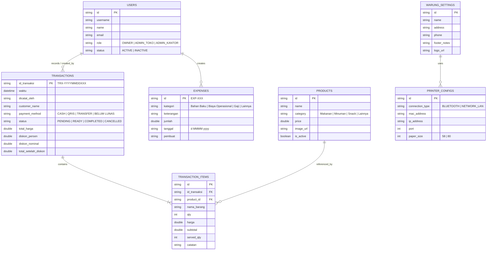

# Skema Database & Data Models - Flutter Rewrite

Dokumen ini memuat detail skema data, *Entity Relationship*, format penyimpanan lokal (*offline cache*), dan kontrak API (*Payload JSON*) aplikasi **Manajemen Warung**.

---

## 1. Entity Relationship Diagram (ERD)



---

## 2. Skema Model Data Dart (Entities & Models)

### 2.1 User & Session Model
```dart
enum UserRole {
  owner('Owner'),
  adminToko('Admin Toko'),
  adminKantor('Admin Kantor');

  final String displayName;
  const UserRole(this.displayName);

  static UserRole fromString(String value) {
    switch (value.toUpperCase()) {
      case 'OWNER':
        return UserRole.owner;
      case 'ADMIN_KANTOR':
        return UserRole.adminKantor;
      case 'ADMIN_TOKO':
      default:
        return UserRole.adminToko;
    }
  }
}

class UserModel {
  final String id;
  final String name;
  final String username;
  final String email;
  final UserRole role;

  UserModel({
    required this.id,
    required this.name,
    required this.username,
    required this.email,
    required this.role,
  });

  factory UserModel.fromJson(Map<String, dynamic> json) => UserModel(
        id: json['id'] ?? '',
        name: json['name'] ?? '',
        username: json['username'] ?? '',
        email: json['email'] ?? '',
        role: UserRole.fromString(json['role'] ?? ''),
      );

  Map<String, dynamic> toJson() => {
        'id': id,
        'name': name,
        'username': username,
        'email': email,
        'role': role.name.toUpperCase(),
      };
}
```

### 2.2 Product (Menu Item) Model
```dart
class ProductModel {
  final String id;
  final String name;
  final String category;
  final double price;
  final String? imageUrl;

  ProductModel({
    required this.id,
    required this.name,
    required this.category,
    required this.price,
    this.imageUrl,
  });

  factory ProductModel.fromJson(Map<String, dynamic> json) => ProductModel(
        id: json['id'] ?? '',
        name: json['name'] ?? '',
        category: json['category'] ?? 'Lainnya',
        price: (json['price'] as num?)?.toDouble() ?? 0.0,
        imageUrl: json['imageUrl'] ?? json['image_url'],
      );

  Map<String, dynamic> toJson() => {
        'id': id,
        'name': name,
        'category': category,
        'price': price,
        'imageUrl': imageUrl,
      };
}
```

### 2.3 Transaction & Order Models
```dart
class TransactionItemModel {
  final String itemId;
  final String namaBarang;
  final int qty;
  final double harga;
  final double subTotal;
  final int servedQty;
  final String catatan;

  TransactionItemModel({
    required this.itemId,
    required this.namaBarang,
    required this.qty,
    required this.harga,
    double? subTotal,
    this.servedQty = 0,
    this.catatan = '',
  }) : subTotal = subTotal ?? (qty * harga);

  factory TransactionItemModel.fromJson(Map<String, dynamic> json) => TransactionItemModel(
        itemId: json['id'] ?? json['itemId'] ?? json['product_id'] ?? '',
        namaBarang: json['namaItem'] ?? json['namaBarang'] ?? json['name'] ?? '',
        qty: json['jumlah'] ?? json['qty'] ?? json['quantity'] ?? 1,
        harga: (json['harga'] ?? json['unit_price'] ?? 0 as num).toDouble(),
        subTotal: (json['subtotal'] ?? json['subTotal'] as num?)?.toDouble(),
        servedQty: json['servedQty'] ?? 0,
        catatan: json['catatan'] ?? '',
      );

  Map<String, dynamic> toJson() => {
        'itemId': itemId,
        'namaBarang': namaBarang,
        'qty': qty,
        'harga': harga,
        'subTotal': subTotal,
        'servedQty': servedQty,
        'catatan': catatan,
      };
}

class TransactionModel {
  final String kodeTransaksi;
  final DateTime tanggalTransaksi;
  final String customerName;
  final String status; // PENDING, READY, COMPLETED, CANCELLED
  final String paymentMethod;
  final String dicatatOleh;
  final List<TransactionItemModel> items;
  final double totalHarga;
  final double diskonPersen;
  final double diskonNominal;
  final double totalSetelahDiskon;

  TransactionModel({
    required this.kodeTransaksi,
    required this.tanggalTransaksi,
    this.customerName = '',
    this.status = 'PENDING',
    this.paymentMethod = 'CASH',
    this.dicatatOleh = 'Admin Toko',
    required this.items,
    required this.totalHarga,
    this.diskonPersen = 0.0,
    this.diskonNominal = 0.0,
    double? totalSetelahDiskon,
  }) : totalSetelahDiskon = totalSetelahDiskon ?? (totalHarga - diskonNominal);

  factory TransactionModel.fromJson(Map<String, dynamic> json) {
    final rawItems = json['items'] as List<dynamic>? ?? [];
    return TransactionModel(
      kodeTransaksi: json['idTransaksi'] ?? json['kodeTransaksi'] ?? '',
      tanggalTransaksi: json['waktu'] != null
          ? DateTime.tryParse(json['waktu']) ?? DateTime.now()
          : (json['tanggalTransaksi'] != null
              ? DateTime.fromMillisecondsSinceEpoch(json['tanggalTransaksi'])
              : DateTime.now()),
      customerName: json['customerName'] ?? json['customer_name'] ?? '',
      status: json['orderStatus'] ?? json['status'] ?? 'PENDING',
      paymentMethod: json['payment_method'] ?? json['paymentMethod'] ?? 'CASH',
      dicatatOleh: json['dicatatOleh'] ?? 'Admin Toko',
      items: rawItems.map((e) => TransactionItemModel.fromJson(e)).toList(),
      totalHarga: (json['totalHarga'] as num?)?.toDouble() ?? 0.0,
      diskonPersen: (json['diskonPersen'] as num?)?.toDouble() ?? 0.0,
      diskonNominal: (json['diskonNominal'] ?? json['discountAmount'] as num?)?.toDouble() ?? 0.0,
      totalSetelahDiskon: (json['totalSetelahDiskon'] as num?)?.toDouble(),
    );
  }
}
```

### 2.4 Expense (Biaya Operasional) Model
```dart
class ExpenseModel {
  final String id;
  final String kategori;
  final String keterangan;
  final double jumlah;
  final String tanggal;
  final String pembuat;

  ExpenseModel({
    required this.id,
    required this.kategori,
    required this.keterangan,
    required this.jumlah,
    required this.tanggal,
    required this.pembuat,
  });

  factory ExpenseModel.fromJson(Map<String, dynamic> json) => ExpenseModel(
        id: json['id'] ?? '',
        kategori: json['kategori'] ?? 'Lainnya',
        keterangan: json['keterangan'] ?? '',
        jumlah: (json['jumlah'] as num?)?.toDouble() ?? 0.0,
        tanggal: json['tanggal'] ?? '',
        pembuat: json['pembuat'] ?? '',
      );

  Map<String, dynamic> toJson() => {
        'id': id,
        'kategori': kategori,
        'keterangan': keterangan,
        'jumlah': jumlah,
        'tanggal': tanggal,
        'pembuat': pembuat,
      };
}
```

---

## 3. Skema Penyimpanan Lokal (Hive Boxes)

| Hive Box Name | Type | Isi Data / Key |
| :--- | :--- | :--- |
| `products_box` | `Box<ProductModel>` | Key: Product ID (`PRD-001`), Value: Product Object |
| `transactions_box` | `Box<TransactionModel>` | Key: Kode Transaksi (`TRX-20260905001`), Value: Transaction Object |
| `expenses_box` | `Box<ExpenseModel>` | Key: Expense ID (`EXP-001`), Value: Expense Object |
| `unsynced_tx_box` | `Box<Map>` | Antrean offline create transaction request |
| `unsynced_status_box` | `Box<Map>` | Antrean offline update order status request |
| `settings_box` | `Box<dynamic>` | Key: `last_printer_mac`, `store_name`, `logo_path` |
