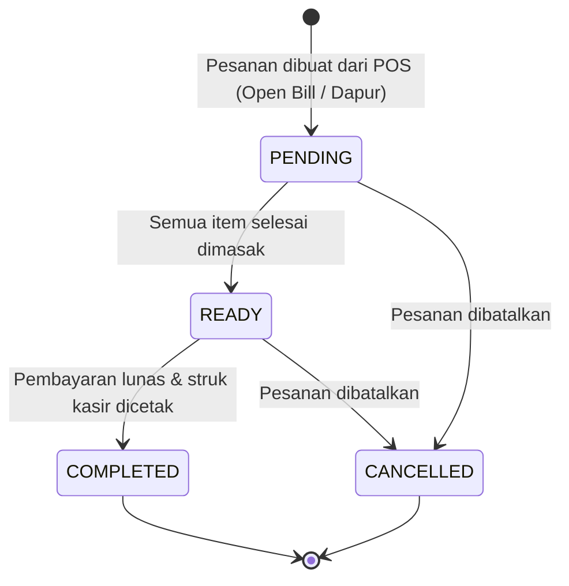

# Rincian Fitur Aplikasi (Feature Specification) - Flutter Rewrite

Dokumen ini menjelaskan secara komprehensif seluruh fitur fungsional dan non-fungsional aplikasi **Manajemen Warung**.

---

## 1. Modul Autentikasi & Hak Akses Berbasis Peran (RBAC)

### 1.1 Login & JWT Token Management
- Pengguna masuk menggunakan `username` dan `password`.
- Server mengembalikan JWT Access Token dan data user (id, nama, email, role).
- Token disimpan dengan enkripsi di `FlutterSecureStorage`.
- Interceptor otomatis menyematkan header `Authorization: Bearer <token>` pada setiap request.
- Jika server merespons dengan HTTP 401 Unauthorized, sesi dihapus otomatis dan user diarahkan kembali ke layar Login.

### 1.2 Matriks Hak Akses (RBAC Matrix)

| Modul / Fitur | Owner | Admin Toko (Kasir) | Admin Kantor (Keuangan) |
| :--- | :---: | :---: | :---: |
| **Dashboard Beranda Ringkasan** | ✅ | ✅ | ✅ |
| **Katalog POS Kasir (Checkout)** | ✅ | ✅ | ❌ |
| **Pesanan Aktif / Dapur (Kitchen)** | ✅ | ✅ | ❌ |
| **Manajemen Barang (CRUD Menu)** | ❌ | ✅ | ❌ |
| **Biaya Operasional (Pengeluaran)** | ❌ | ❌ | ✅ |
| **Laporan Laba Rugi & Analitik** | ✅ | ❌ | ❌ |
| **User Management (CRUD User)** | ✅ | ❌ | ❌ |
| **Pengaturan Warung & Printer** | ✅ | ✅ | ✅ |

---

## 2. Modul Point of Sale (POS) & Kasir

### 2.1 Katalog Menu & Pencarian
- Grid responsif dengan kartu produk yang memuat foto, nama, kategori, dan harga.
- Pencarian *live* berdasarkan nama barang.
- Filter cepat per kategori (*Semua, Makanan, Minuman, Cemilan, dll.*).

### 2.2 Keranjang Belanja (Cart Management)
- Menambah, mengurangi, atau menghapus jumlah porsi item di keranjang.
- Kolom catatan khusus per item (*misal: "Tanpa sambal", "Sedotan 2"*).
- Input nama pemesan / nomor meja (*Customer Name / Table Number*).

### 2.3 Kalkulasi Pembayaran & Diskon
- Diskon fleksibel:
  - **Diskon Persentase (%)**: Misal diskon 10% (otomatis divalidasi 0% - 100%).
  - **Diskon Nominal (Rp)**: Misal potongan Rp 5.000 (divalidasi tidak melebihi subtotal).
- Metode Pembayaran:
  - **Cash (Tunai)**: Input uang diterima dan kalkulasi otomatis uang kembalian.
  - **QRIS**: Tampilan QR code atau konfirmasi pembayaran digital.
  - **Transfer Bank**: Konfirmasi transfer rekening toko.
  - **Belum Lunas (Open Bill / Bayar Nanti)**: Pesanan masuk ke antrean dapur tanpa langsung ditutup.

---

## 3. Modul Pesanan Dapur & Pelacakan Pesanan Aktif (Active Orders)

### 3.1 Siklus Status Pesanan (*Order Lifecycle*)

### 3.2 Pelacakan Porsi yang Sudah Disajikan (*Served Quantity*)
- Setiap baris item di pesanan memiliki counter `servedQty` vs `qty` (contoh: 2/3 tersajikan).
- Tombol (+ / -) untuk menambah porsi yang sudah diantar ke meja pelanggan.
- Ketika semua porsi item terpenuhi (`servedQty == qty`), status pesanan secara otomatis berubah menjadi `READY` (Siap).

### 3.3 Penambahan & Pengeditan Pesanan Berjalan (*Dynamic Order Modification*)
- Kasir/Pelayan dapat menambahkan menu baru ke pesanan aktif tanpa perlu membuat transaksi baru.
- Dapat mengubah jumlah porsi atau menghapus item yang dibatalkan pelanggan sebelum pesanan selesai.

---

## 4. Modul Manajemen Barang (Products)

- **Tambah Barang Baru**: Input nama barang, pilih kategori, harga jual (Rp), dan foto produk via kamera/galeri (*Image Picker*).
- **Edit Barang**: Memperbarui informasi barang yang sudah ada.
- **Hapus Barang**: Menghapus produk dari sistem dengan dialog konfirmasi agar tidak terjadi salah tekan.
- **Sinkronisasi Otomatis**: Daftar produk disimpan di local storage (*Hive*) sehingga kasir tetap bisa melihat katalog saat koneksi internet terputus.

---

## 5. Modul Biaya Operasional (Expenses)

- **Pencatatan Biaya**:
  - Pilihan Kategori: *Bahan Baku, Biaya Operasional, Gaji Karyawan, Listrik/Air, Pemeliharaan, Lainnya*.
  - Nominal Biaya (Rp).
  - Keterangan pengeluaran.
  - Tanggal pengeluaran dan nama pencatat (*Admin Kantor*).
- **Filter Waktu & Rekap Ringkasan**:
  - Filter waktu: *Hari Ini, Minggu Ini, Bulan Ini, Bulan Lalu, Semua*.
  - Kartu ringkasan total pengeluaran sesuai filter yang dipilih.
- **Edit & Hapus Catatan Biaya**: Memperbaiki entri pengeluaran yang keliru diinput.

---

## 6. Modul Laba Rugi & Analitik Keuangan

### 6.1 Perhitungan Finansial
- **Omset Penjualan (Pemasukan Kotor)**: Total akumulasi transaksi berstatus `COMPLETED` (dikurangi diskon).
- **Total Pengeluaran**: Akumulasi seluruh biaya operasional dalam periode waktu yang sama.
- **Laba Bersih**: $\text{Laba Bersih} = \text{Omset Penjualan} - \text{Total Pengeluaran}$.

### 6.2 Visualisasi Grafik & Analisis Produk
- **Grafik Batang Transaksi 7 Hari Terakhir**: Visualisasi perbandingan penjualan Senin–Minggu menggunakan `fl_chart`.
- **Top 5 Menu Terlaris**: Daftar 5 menu dengan jumlah porsi terjual dan total pendapatan tertinggi.
- **Tabel Rincian Harian**: Rekap transaksi harian (Tanggal, Jumlah Order, Total Penjualan).

---

## 7. Modul Hardware Thermal Printing (ESC/POS) & Export Dokumen

### 7.1 Cetak Struk Bluetooth & LAN
- **Printer Bluetooth SPP**:
  - Scan perangkat Bluetooth yang sudah dipasangkan (*paired devices*).
  - Simpan MAC address printer default.
  - Kirim byte command ESC/POS (Inisialisasi `0x1B 0x40`, Align Left `0x1B 0x61 0x00`, CRLF, Feed `0x0A 0x0A 0x0A 0x0A`).
- **Printer Network / LAN (Ethernet/WiFi)**:
  - Input IP Address printer kasir dan Port (default: 9100).
  - Pengiriman raw socket TCP.
- **Jenis Format Struk**:
  1. **Struk Pembayaran Kasir**: Nama warung, No. Transaksi, Tanggal/Jam, Kasir, Daftar Item & Harga, Subtotal, Diskon, Total Bayar, Metode Bayar, Footer.
  2. **Struk Dapur (Kitchen Order Ticket)**: Header Dapur, No. Transaksi, Jam, Nama Pelanggan, Daftar Item & Catatan (tanpa nominal harga).

### 7.2 Generator Export PDF & Excel
- **Export PDF**:
  - Faktur/Quotation Pesanan.
  - Laporan Biaya Operasional (A4).
  - Laporan Laba Rugi Komprehensif (A4).
- **Export Excel (.xlsx)**:
  - Ekspor seluruh tabel transaksi penjualan dan daftar pengeluaran ke file spreadsheet Excel.

---

## 8. Modul Pengaturan & Manajemen Pengguna

- **Pengaturan Warung**:
  - Mengubah Nama Toko, Alamat, No. Telepon, dan Catatan Footer Struk.
  - Mengganti dan mengunggah Logo Toko.
- **User Management (Khusus Owner)**:
  - Menambah akun kasir / staf baru.
  - Mengubah hak akses role (*Owner, Admin Toko, Admin Kantor*).
  - Mengaktifkan / menonaktifkan akun staf.
- **Profil Staf**:
  - Mengubah nama tampilan profil dan memperbarui kata sandi.

---

## 9. Fitur Offline Resilience & Sinkronisasi Otomatis

- Jika koneksi internet terputus di tengah jam sibuk warung:
  - Transaksi kasir tetap dapat diproses dan dicetak struknya secara lokal.
  - Data transaksi disimpan ke antrean offline `unsynced_transactions`.
  - Ketika koneksi internet pulih, worker sinkronisasi latar belakang otomatis mengirim data tertunda ke server backend tanpa mengganggu operasional kasir.
