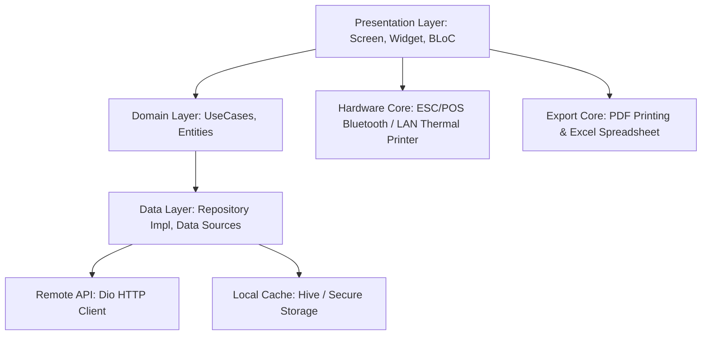
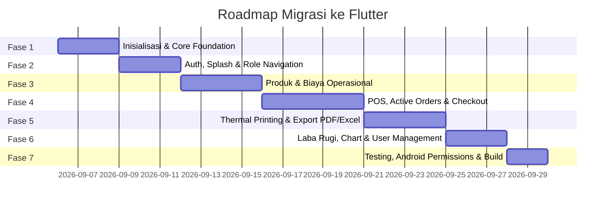

# Implementation Plan - Rewrite Manajemen Warung ke Flutter

Dokumen ini menyajikan rencana menyeluruh (*roadmap & architectural blueprint*) untuk melakukan *rewrite* aplikasi **Manajemen Warung** dari Android Native (Kotlin + Jetpack Compose) ke **Flutter** (*cross-platform*).

---

## 1. Ringkasan & Tujuan Proyek

Aplikasi **Manajemen Warung** adalah sistem Point of Sale (POS), manajemen stok/menu, pencatatan biaya operasional, dan pelaporan laba-rugi terintegrasi untuk bisnis F&B / UMKM Warung.

Tujuan penulisan ulang ke Flutter:
- **Cross-Platform**: Satu basis kode (*single codebase*) untuk Android (Smartphone, Tablet/POS Device), iOS, dan Desktop (Windows/macOS/Linux jika diperlukan di kasir kantor).
- **Performa & UI Konsisten**: Memanfaatkan Material 3 Flutter dengan animasi halus, responsif di berbagai ukuran layar (*foldable, tablet, phone*).
- **Offline-First & Reliable Hardware Integration**: Tetap mendukung pencetakan printer thermal Bluetooth & Network ESC/POS, export PDF/Excel, serta antrean sinkronisasi *offline*.

---

## 2. Peta Arsitektur Target (Clean Architecture Feature-First)



### Struktur Direktori Proyek Flutter:
```
lib/
├── app/
│   ├── config/             # Theme, Colors, Typography, App Constants
│   ├── routes/             # GoRouter navigation & Role-based Guards
│   └── observers/          # BlocObserver, RouteObserver
├── core/
│   ├── network/            # Dio Client, Auth Interceptor, Error Handler
│   ├── storage/            # FlutterSecureStorage & Hive/SharedPreferences
│   ├── printing/           # ESC/POS Bluetooth & LAN Thermal Printer Manager
│   ├── export/             # PDF Invoice/Report Generator & Excel Exporter
│   └── utils/              # Currency (formatRupiah), Date & Dialog Helpers
├── features/
│   ├── auth/               # Login, JWT Session, Splash, Token Management
│   ├── dashboard/          # Home Overview, Bottom Nav Shell, Role Dispatcher
│   ├── pos/                # POS Catalog, Cart, Checkout, Payment Dialog
│   ├── active_orders/      # Kitchen / Dapur Order Tracking, Served Qty, Add/Edit Item
│   ├── products/           # Product CRUD, Categories, Image Picker
│   ├── expenses/           # Operational Expenses CRUD, Date Filter, Summaries
│   ├── reports/            # Laba Rugi, Sales Analytics, Charts, Best Sellers
│   ├── settings/           # Store Profile, Logo, Printer Preferences
│   └── user_management/    # Owner-only User CRUD & Role Assignment
└── main.dart
```

---

## 3. Roadmap Langkah-Langkah Eksekusi



### **Fase 1: Inisialisasi Proyek & Core Foundation**
1. Buat proyek Flutter baru dengan Flutter 3.x+ dan Dart 3:
   ```bash
   flutter create --org com.warung --platforms android,ios,windows,macos manajemen_warung
   ```
2. Pasang dependensi inti:
   - State & Routing: `flutter_bloc`, `equatable`, `go_router`
   - Networking & Storage: `dio`, `flutter_secure_storage`, `hive_flutter`, `shared_preferences`
   - Hardware & Dokumen: `print_bluetooth_thermal`, `esc_pos_utils_plus`, `pdf`, `printing`, `excel`, `open_filex`, `path_provider`
   - UI & Utilities: `intl`, `fl_chart`, `google_fonts`, `image_picker`
3. Konfigurasi Material 3 Design System (`AppColors`, `AppTypography`, `AppTheme`).
4. Setup `Dio` HTTP Client dengan Interceptor untuk otomatis menyematkan header `Authorization: Bearer <token>` dan *error handling* terpusat.
5. Buat helper utilitas: `CurrencyFormatter.formatRupiah(num)` dan format tanggal Bahasa Indonesia.

---

### **Fase 2: Autentikasi, Splash Screen, & Shell Role Navigation**
1. Implementasi `AuthRepository` & `AuthBloc` (`LoginEvent`, `LogoutEvent`, `CheckAuthEvent`).
2. Buat `SplashScreen`: Cek token lokal via `FlutterSecureStorage` $\rightarrow$ auto-login jika valid atau arahkan ke `LoginScreen`.
3. Buat `LoginScreen`: Form username/password, tombol masuk, loading indicator, dan pesan error.
4. Buat `DashboardShell`: Bottom Navigation Bar dinamis berbasis role:
   - `OWNER`: Beranda, Laba Rugi, Penjualan, User Management, Profile.
   - `ADMIN_TOKO`: Beranda, Penjualan (POS & Pesanan Dapur), Barang, Profile.
   - `ADMIN_KANTOR`: Beranda, Biaya Operasional, Profile.

---

### **Fase 3: Modul Manajemen Barang & Biaya Operasional**
1. **Modul Manajemen Barang (Products)**:
   - Layar daftar produk dengan pencarian dan filter kategori (*Makanan, Minuman, Snack, dll.*).
   - Dialog/Formulir Tambah & Edit Produk (Upload/Pilih Gambar, Nama, Kategori, Harga).
   - Dialog Konfirmasi Hapus Produk.
2. **Modul Biaya Operasional (Expenses)**:
   - Layar daftar pengeluaran dengan filter tanggal (*Hari Ini, Minggu Ini, Bulan Ini, Bulan Lalu, Semua*).
   - Ringkasan total biaya operasional (Harian, Mingguan, Bulanan).
   - Dialog Tambah, Edit, dan Hapus Catatan Pengeluaran.

---

### **Fase 4: Point of Sale (POS) & Pesanan Aktif (Dapur / Active Orders)**
1. **Katalog & Keranjang Kasir (POS)**:
   - Tampilan grid responsif produk dengan pemilih jumlah porsi (*quantity*).
   - Drawer/Bottomsheet keranjang belanja (*cart summary*) & catatan per pesanan.
   - Modal Pembayaran: Diskon persentase (%) atau nominal (Rp), metode pembayaran (*Cash, QRIS, Transfer*), dan kalkulasi kembalian.
2. **Pesanan Aktif (Kitchen / Active Orders)**:
   - Polling / real-time update daftar pesanan berstatus `PENDING` dan `READY`.
   - Pelacakan jumlah yang sudah disajikan (*served quantity*) per item menu.
   - Tambah item baru (*Add item*) atau edit jumlah pesanan yang sedang berjalan.
   - Tombol cepat ubah status: Dapur $\rightarrow$ Siap Saji $\rightarrow$ Selesai (Bayar).

---

### **Fase 5: Thermal Printer (Bluetooth & LAN) & Export PDF/Excel**
1. **Hardware Thermal Printer**:
   - Deteksi printer Bluetooth *paired* dan koneksi socket LAN/Network IP:Port.
   - Template ESC/POS: **Struk Pembayaran Kasir** dan **Struk Pesanan Dapur**.
   - Simpan preferensi printer terakhir di local storage.
2. **Export PDF**:
   - PDF Invoice / Quotation pesanan.
   - PDF Laporan Biaya Operasional.
   - PDF Laporan Laba Rugi.
3. **Export Excel (.xlsx)**:
   - Spreadsheet riwayat transaksi penjualan & rekap pengeluaran.

---

### **Fase 6: Laporan Analitik Laba Rugi & User Management**
1. **Laba Rugi & Analitik**:
   - Metrik finansial: Omset Total, Total Pengeluaran Operasional, Laba Bersih.
   - Visualisasi grafik batang penjualan menggunakan `fl_chart`.
   - Daftar 5 Menu Terlaris (*Top 5 Best Seller Items*).
   - Rekap tabel rincian transaksi harian.
2. **User Management (Khusus Owner)**:
   - Daftar staf/pengguna, tambah akun baru, ubah role (*Owner, Admin Toko, Admin Kantor*), reset password, hapus user.
3. **Pengaturan Warung & Profil**:
   - Pengaturan profil pengguna (ganti nama, ubah kata sandi).
   - Pengaturan warung (nama warung, alamat toko, catatan footer struk, logo toko).

---

### **Fase 7: Testing, Perizinan Android, & Build Deployment**
1. **Konfigurasi Android Native**:
   - Izin `AndroidManifest.xml`: `BLUETOOTH_CONNECT`, `BLUETOOTH_SCAN`, `INTERNET`, `ACCESS_FINE_LOCATION`, `WRITE_EXTERNAL_STORAGE` (legacy).
2. **Unit & Widget Testing**:
   - Testing kalkulasi diskon, rumus laba-rugi, dan parsing response JSON.
3. **Build & Release**:
   - `flutter build apk --release` (Universal / Split per ABI) & `flutter build appbundle`.

---

## 4. Referensi Dokumen Terkait

Dokumen terpisah telah dibuat untuk mendetailkan masing-masing aspek teknis:
- 🏗️ **Core Apps & Architecture**: [`core_apps.md`](file:///home/padikering/Documents/KERJA/manajemen-warung-fe/core_apps.md)
- 🗄️ **Skema Database & Data Models**: [`database_schema.md`](file:///home/padikering/Documents/KERJA/manajemen-warung-fe/database_schema.md)
- 📱 **Daftar & Spesifikasi Screen UI**: [`screens.md`](file:///home/padikering/Documents/KERJA/manajemen-warung-fe/screens.md)
- ⚡ **Rincian Fitur Komprehensif**: [`features.md`](file:///home/padikering/Documents/KERJA/manajemen-warung-fe/features.md)
