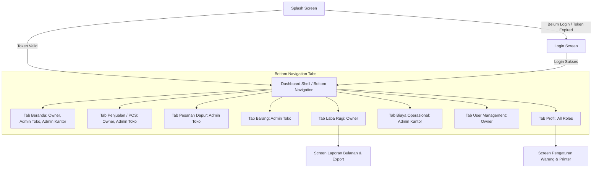
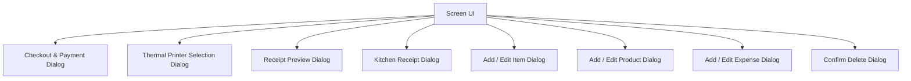

# Daftar & Spesifikasi Screen UI - Flutter Rewrite

Dokumen ini mendokumentasikan seluruh layar (*screens*), navigasi, hierarki widget, dan dialog interaktif pada aplikasi **Manajemen Warung**.

---

## 1. Peta Navigasi Aplikasi (Navigation Flow)

---

## 2. Detail Spesifikasi Layar (Screens)

### 2.1 `SplashScreen`
- **Tujuan**: Memeriksa keberadaan JWT token di `FlutterSecureStorage`.
- **UI Elements**:
  - Logo Warung (animasi fade/scale).
  - Teks aplikasi: "Manajemen Warung".
  - `CircularProgressIndicator` di bagian bawah.
- **Logika**:
  - Jika token ada $\rightarrow$ panggil `GET /users/me` untuk validasi $\rightarrow$ masuk ke Dashboard sesuai `role`.
  - Jika token kosong / error $\rightarrow$ arahkan ke `LoginScreen`.

---

### 2.2 `LoginScreen`
- **Tujuan**: Halaman masuk pengguna (Owner, Admin Toko, Admin Kantor).
- **UI Elements**:
  - Header ilustrasi / Logo Toko.
  - Form Input: `Username` & `Password` (dengan toggle obscure text).
  - Tombol **"Masuk ke Sistem"** dengan state loading.
  - Alert error jika kredensial tidak sesuai (401 Unauthorized).

---

### 2.3 `DashboardShell` (Bottom Navigation Bar)
- **Tujuan**: Container utama dengan bar navigasi bawah yang ditampilkan secara dinamis berdasarkan *Role*:

| Role | Menu Bawah yang Muncul |
| :--- | :--- |
| **Owner** | Beranda, Laba Rugi, Penjualan, User Management, Profile |
| **Admin Toko (Kasir)** | Beranda, Penjualan (POS & Dapur), Barang (Menu), Profile |
| **Admin Kantor (Keuangan)** | Beranda, Biaya Operasional, Profile |

---

### 2.4 `BerandaTab`
- **Tujuan**: Tampilan ringkasan operasional harian.
- **UI Elements**:
  - Header: Ucapan selamat datang, nama pengguna, badge Role, dan icon Logout.
  - Tanggal hari ini (format Bahasa Indonesia).
  - **Kartu Ringkasan Penjualan** (Admin Toko): Pemasukan hari ini, jumlah transaksi sukses vs dibatalkan.
  - **Kartu Ringkasan Pengeluaran** (Owner & Admin Kantor): Kartu Harian, Mingguan, Bulanan (warna merah *danger*).
  - **Grafik Batang Transaksi** (*Bar Chart* 7 hari terakhir: Sen, Sel, Rab, Kam, Jum, Sab, Min).
  - Grid menu pintasan cepat.

---

### 2.5 `PosScreen` (Point of Sale / Kasir)
- **Tujuan**: Input transaksi kasir, pemilihan menu, keranjang belanja, dan pembayaran.
- **UI Elements**:
  - Search bar menu & filter kategori tab horizontal (*Semua, Makanan, Minuman, Snack, dll.*).
  - Grid card menu dengan foto, nama barang, harga (Rp), dan tombol (+ / -).
  - **Floating Cart Button / Bottom Sheet Keranjang**:
    - List barang yang dipilih, subtotal per item.
    - Input nama pelanggan & catatan pesanan (misal: "Pedas sedang").
    - Tombol **"Bayar / Checkout"**.

---

### 2.6 `ActiveOrdersTab` (Pesanan Aktif / Dapur)
- **Tujuan**: Monitor pesanan yang sedang diproses di dapur secara *real-time*.
- **UI Elements**:
  - List kartu pesanan berstatus `PENDING` (Dapur) & `READY` (Siap).
  - Rincian item menu dan *Served Quantity Tracker* (misal: 2/3 disajikan).
  - Aksi pada pesanan:
    - Tombol **"Tambah Menu"**: Membuka dialog cari produk untuk ditambahkan ke pesanan aktif.
    - Tombol **"Edit Qty / Hapus Item"**.
    - Tombol **"Cetak Struk Dapur"** (format ringkas untuk koki).
    - Tombol **"Tandai Siap"** $\rightarrow$ status berubah jadi `READY`.
    - Tombol **"Proses Bayar"** $\rightarrow$ membuka Dialog Pembayaran.

---

### 2.7 `ManajemenBarangTab` (Katalog Produk)
- **Tujuan**: Manajemen produk jualan warung.
- **UI Elements**:
  - Search bar & filter kategori.
  - FAB (**+ Tambah Produk**).
  - List produk: Gambar, nama, kategori, harga.
  - Tombol aksi: Edit produk & Hapus produk.

---

### 2.8 `BiayaOperasionalTab` (Pengeluaran)
- **Tujuan**: Pencatatan pengeluaran harian/mingguan/bulanan.
- **UI Elements**:
  - Filter waktu (*Hari Ini, Minggu Ini, Bulan Ini, Bulan Lalu, Semua*).
  - Ringkasan total nominal pengeluaran berdasarkan filter aktif.
  - List catatan biaya (Kategori, Keterangan, Tanggal, Nominal, Dicatat Oleh).
  - FAB (**+ Tambah Pengeluaran**).

---

### 2.9 `LabaRugiTab` (Laporan Keuangan & Analitik)
- **Tujuan**: Analitik laba bersih dan performa jualan untuk Owner.
- **UI Elements**:
  - Kartu Omset Penjualan, Total Biaya, dan Laba Bersih (*Profit/Loss*).
  - Rekap **5 Menu Terlaris** (*Top Best Sellers*).
  - Rekap tabel rincian transaksi harian.
  - Tombol **"Laporan Bulanan & Export"** $\rightarrow$ menuju `MonthlyReportScreen`.

---

### 2.10 `UserManagementTab` (Khusus Owner)
- **Tujuan**: Manajemen akun kasir dan staf kantor.
- **UI Elements**:
  - List akun terdaftar beserta Role & Status.
  - FAB (**+ Tambah Pengguna Baru**).
  - Opsi: Ubah Role, Ganti Password, Nonaktifkan Akun.

---

### 2.11 `ProfileTab` & `SettingsScreen`
- **Tujuan**: Pengaturan profil dan perangkat keras printer.
- **UI Elements**:
  - Avatar, nama user, email, role badge.
  - Tombol edit nama profil.
  - Menu Pengaturan Warung (Nama toko, Alamat, Upload logo toko).
  - Menu Pengaturan Printer (Pilih Printer Bluetooth default, setting IP & Port Network Printer).
  - Tombol Logout.

---

## 3. Daftar Dialog Interaktif & Modal

1. **PaymentDialog**:
   - Menampilkan total tagihan pesanan.
   - Input Diskon: Opsi Diskon Persen (%) atau Diskon Nominal (Rp).
   - Pilihan metode bayar: Cash, QRIS, Transfer.
   - Perhitungan kembalian tunai (*cash change*).
2. **PrinterDialog**:
   - Menampilkan daftar perangkat Bluetooth *paired*.
   - Tombol simpan printer default dan uji cetak (*test print*).
3. **ReceiptPreviewDialog**:
   - Preview struk monospaced.
   - Tombol "Export PDF" dan "Cetak Struk Thermal".
4. **KitchenReceiptDialog**:
   - Preview struk ringkas untuk staf dapur.
5. **AddEditProductDialog**:
   - Form nama menu, pilihan kategori (*Dropdown*), input harga, dan tombol ambil foto (*Image Picker*).
6. **AddEditExpenseDialog**:
   - Form kategori biaya (*Bahan Baku, Operasional, Gaji, dll.*), nominal Rp, tanggal, keterangan.
