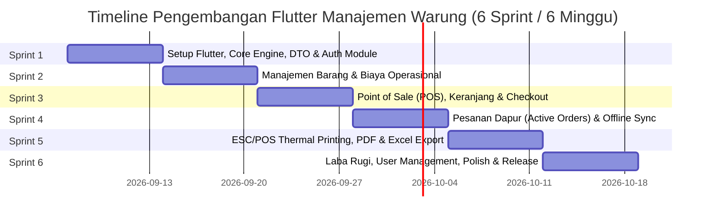

# Timeline & Roadmap Pengembangan Aplikasi Manajemen Warung (Flutter Rewrite)

Dokumen ini menggabungkan seluruh rancangan dari [plan.md](file:///home/padikering/Documents/KERJA/manajemen-warung-fe/plan.md), [core_apps.md](file:///home/padikering/Documents/KERJA/manajemen-warung-fe/core_apps.md), [database_schema.md](file:///home/padikering/Documents/KERJA/manajemen-warung-fe/database_schema.md), [screens.md](file:///home/padikering/Documents/KERJA/manajemen-warung-fe/screens.md), dan [features.md](file:///home/padikering/Documents/KERJA/manajemen-warung-fe/features.md) ke dalam **satu timeline pengembangan terpadu** *(Database utama dikelola oleh Backend Server, fokus Frontend adalah integrasi API, Model DTO, dan Local Cache)*.

---

## 1. Visualisasi Timeline (Gantt Chart)



---

## 2. Rincian Pekerjaan per Sprint

---

### 🔹 **Sprint 1: Fondasi Proyek, Core Layer, Model DTO & Auth Module**
**Durasi**: Minggu 1 (Hari 1 – 7)  
**Fokus**: Inisialisasi arsitektur, konfigurasi core library, otentikasi JWT, model DTO user, dan routing dinamis berbasis peran.

| No | Kategori | Komponen / Fitur yang Dibuat | Referensi Dokumen |
| :---: | :--- | :--- | :--- |
| 1.1 | **Project Setup** | Inisialisasi Flutter 3.x, konfigurasi `pubspec.yaml`, struktur folder *Feature-First*. | [core_apps.md](file:///home/padikering/Documents/KERJA/manajemen-warung-fe/core_apps.md) |
| 1.2 | **Theme & Utils** | Implementasi `AppTheme` Material 3, Palet Warna (`Primary`, `Success`, `Danger`), `Formatters.formatRupiah()`, tanggal Indonesia (`intl`). | [core_apps.md](file:///home/padikering/Documents/KERJA/manajemen-warung-fe/core_apps.md) |
| 1.3 | **Core Network** | `ApiClient` (`Dio`) dengan `Interceptors` untuk otomatis menyematkan header `Authorization: Bearer <token>` dan penanganan error 401. | [core_apps.md](file:///home/padikering/Documents/KERJA/manajemen-warung-fe/core_apps.md) |
| 1.4 | **Core Local Storage** | Setup `FlutterSecureStorage` (Token JWT) dan inisialisasi `Hive` boxes (`products_box`, `transactions_box`, `expenses_box`) untuk *offline cache*. | [core_apps.md](file:///home/padikering/Documents/KERJA/manajemen-warung-fe/core_apps.md) |
| 1.5 | **Data Models (DTO)** | Mapping JSON DTO: `UserModel`, `UserRole` (`OWNER`, `ADMIN_TOKO`, `ADMIN_KANTOR`), `LoginRequest`, `LoginResponse` sesuai kontrak API backend. | [database_schema.md](file:///home/padikering/Documents/KERJA/manajemen-warung-fe/database_schema.md) |
| 1.6 | **State & Routing** | `AuthBloc` (Login, Logout, CheckSession) dan `GoRouter` dengan *Route Guards* & *Role-based redirection*. | [plan.md](file:///home/padikering/Documents/KERJA/manajemen-warung-fe/plan.md) |
| 1.7 | **Screens** | `SplashScreen` (Cek sesi lokal), `LoginScreen` (Form input & error alert), `DashboardShell` (BottomNav dinamis sesuai role). | [screens.md](file:///home/padikering/Documents/KERJA/manajemen-warung-fe/screens.md) |

**Deliverable Sprint 1**: Aplikasi dapat dibuka, user dapat login sesuai role, sesi tersimpan aman, dan navigasi menu bawah tampil dinamis sesuai hak akses.

---

### 🔹 **Sprint 2: Modul Manajemen Barang & Biaya Operasional (API Integration)**
**Durasi**: Minggu 2 (Hari 8 – 14)  
**Fokus**: Pengelolaan katalog menu/produk jualan dan pencatatan pengeluaran operasional warung terintegrasi ke backend API.

| No | Kategori | Komponen / Fitur yang Dibuat | Referensi Dokumen |
| :---: | :--- | :--- | :--- |
| 2.1 | **Data Layer (DTO & API)** | DTO `ProductModel`, `ExpenseModel`, `ProductRepository`, `ExpenseRepository`, remote data source via Dio & local cache fallback. | [database_schema.md](file:///home/padikering/Documents/KERJA/manajemen-warung-fe/database_schema.md) |
| 2.2 | **State Management** | `ProductBloc` (Fetch, Search, Add, Edit, Delete) & `ExpenseBloc` (Fetch, Filter, Add, Edit, Delete). | [plan.md](file:///home/padikering/Documents/KERJA/manajemen-warung-fe/plan.md) |
| 2.3 | **Screen Barang** | `ManajemenBarangTab`: List barang, filter kategori (*Makanan, Minuman, Snack, dll.*), pencarian live produk. | [screens.md](file:///home/padikering/Documents/KERJA/manajemen-warung-fe/screens.md) |
| 2.4 | **Dialog Barang** | `AddEditProductDialog`: Form nama, dropdown kategori, input harga, pilih foto (`image_picker`), `ConfirmDeleteDialog`. | [screens.md](file:///home/padikering/Documents/KERJA/manajemen-warung-fe/screens.md) |
| 2.5 | **Screen Biaya** | `BiayaOperasionalTab`: List pengeluaran, filter waktu (*Hari Ini, Minggu Ini, Bulan Ini, Bulan Lalu, Semua*), kartu ringkasan total. | [screens.md](file:///home/padikering/Documents/KERJA/manajemen-warung-fe/screens.md) |
| 2.6 | **Dialog Biaya** | `AddEditExpenseDialog`: Form kategori (*Bahan Baku, Operasional, Gaji, dll.*), nominal Rp, tanggal, keterangan. | [screens.md](file:///home/padikering/Documents/KERJA/manajemen-warung-fe/screens.md) |

**Deliverable Sprint 2**: Admin Toko dapat mengelola katalog menu produk lengkap dengan gambar; Admin Kantor dapat mencatat dan memfilter pengeluaran operasional warung.

---

### 🔹 **Sprint 3: Point of Sale (POS), Keranjang & Checkout Kasir**
**Durasi**: Minggu 3 (Hari 15 – 21)  
**Fokus**: Input transaksi kasir, pemilihan barang cepat, perhitungan diskon, dan berbagai metode pembayaran.

| No | Kategori | Komponen / Fitur yang Dibuat | Referensi Dokumen |
| :---: | :--- | :--- | :--- |
| 3.1 | **Data Layer (DTO & API)** | DTO `TransactionModel`, `TransactionItemModel`, `TransactionRequest`, `PosRepository` integrasi endpoint `/transactions`. | [database_schema.md](file:///home/padikering/Documents/KERJA/manajemen-warung-fe/database_schema.md) |
| 3.2 | **State Management** | `PosBloc` (Load catalog, filter, search) & `CartBloc` (Add item, adjust quantity, add notes, calculate subtotal). | [plan.md](file:///home/padikering/Documents/KERJA/manajemen-warung-fe/plan.md) |
| 3.3 | **Screen POS** | `PosScreen`: Grid menu responsif, kartu produk dengan foto, harga, tombol (+/-), badge jumlah terpilih. | [screens.md](file:///home/padikering/Documents/KERJA/manajemen-warung-fe/screens.md) |
| 3.4 | **Cart UI** | BottomSheet / Drawer Keranjang Belanja, input nama pemesan / no meja, catatan per menu (*misal: "Pedas sedang"*). | [features.md](file:///home/padikering/Documents/KERJA/manajemen-warung-fe/features.md) |
| 3.5 | **Modal Pembayaran** | `PaymentDialog`: Kalkulasi total, diskon (% atau Rp), pilihan metode bayar (*Cash, QRIS, Transfer, Belum Lunas*), kalkulasi uang kembalian. | [screens.md](file:///home/padikering/Documents/KERJA/manajemen-warung-fe/screens.md) |

**Deliverable Sprint 3**: Kasir dapat memilih menu, memasukkan ke keranjang, memberi diskon, memilih metode bayar, dan menyelesaikan pesanan baru.

---

### 🔹 **Sprint 4: Pesanan Dapur (Active Orders) & Offline Sync Engine**
**Durasi**: Minggu 4 (Hari 22 – 28)  
**Fokus**: Pemantauan pesanan dapur *real-time*, pelacakan porsi tersaji, modifikasi pesanan berjalan, dan ketahanan offline.

| No | Kategori | Komponen / Fitur yang Dibuat | Referensi Dokumen |
| :---: | :--- | :--- | :--- |
| 4.1 | **State & Polling** | `ActiveOrdersBloc`: Polling otomatis sinkronisasi status pesanan aktif (`PENDING` dan `READY`). | [plan.md](file:///home/padikering/Documents/KERJA/manajemen-warung-fe/plan.md) |
| 4.2 | **Screen Dapur** | `ActiveOrdersTab`: Kartu pesanan dengan status badge (DAPUR vs SIAP), waktu order, nama pemesan, rincian menu. | [screens.md](file:///home/padikering/Documents/KERJA/manajemen-warung-fe/screens.md) |
| 4.3 | **Served Tracker** | Pelacakan porsi tersaji (*Served Qty* counter per item). Otomatis update status ke `READY` saat semua item siap. | [features.md](file:///home/padikering/Documents/KERJA/manajemen-warung-fe/features.md) |
| 4.4 | **Modifikasi Pesanan** | `AddItemsToActiveOrderDialog` (tambah menu ke pesanan berjalan), `EditItemQtyDialog` (ubah porsi / batalkan item). | [screens.md](file:///home/padikering/Documents/KERJA/manajemen-warung-fe/screens.md) |
| 4.5 | **Offline Sync Engine** | `SyncQueueService`: Simpan request transaksi ke antrean lokal saat offline, kirim otomatis saat koneksi pulih (*Auto-Retry FIFO*). | [core_apps.md](file:///home/padikering/Documents/KERJA/manajemen-warung-fe/core_apps.md) |

**Deliverable Sprint 4**: Staf dapur dan kasir dapat melacak pesanan aktif, mengupdate porsi tersaji, menambah menu ke meja aktif, dan transaksi tetap aman meski jaringan internet putus.

---

### 🔹 **Sprint 5: Hardware Thermal Printing (ESC/POS) & Export Dokumen**
**Durasi**: Minggu 5 (Hari 29 – 35)  
**Fokus**: Integrasi printer struk Bluetooth & Network LAN serta generator ekspor file PDF dan Excel.

| No | Kategori | Komponen / Fitur yang Dibuat | Referensi Dokumen |
| :---: | :--- | :--- | :--- |
| 5.1 | **ESC/POS Builder** | `EscPosBuilder`: Generator byte ESC/POS untuk ukuran kertas 58mm dan 80mm. | [core_apps.md](file:///home/padikering/Documents/KERJA/manajemen-warung-fe/core_apps.md) |
| 5.2 | **Bluetooth Printing** | `BluetoothPrinterService` via `print_bluetooth_thermal`: Scan paired devices, koneksi SPP UUID, cetak struk kasir & dapur. | [core_apps.md](file:///home/padikering/Documents/KERJA/manajemen-warung-fe/core_apps.md) |
| 5.3 | **Network LAN Printing**| `NetworkPrinterService`: Pengiriman byte ESC/POS via raw TCP socket (`Socket.connect(ip, port)`). | [core_apps.md](file:///home/padikering/Documents/KERJA/manajemen-warung-fe/core_apps.md) |
| 5.4 | **Dialog Struk & Printer**| `PrinterSelectionDialog` (Pilih printer & simpan MAC address), `ReceiptPreviewDialog`, `KitchenReceiptDialog`. | [screens.md](file:///home/padikering/Documents/KERJA/manajemen-warung-fe/screens.md) |
| 5.5 | **Export PDF** | `PdfGeneratorService`: Cetak Faktur/Quotation, Laporan Biaya Operasional, dan Laporan Laba Rugi format A4. | [core_apps.md](file:///home/padikering/Documents/KERJA/manajemen-warung-fe/core_apps.md) |
| 5.6 | **Export Excel** | `ExcelExportService` via package `excel`: Ekspor rekap transaksi penjualan & pengeluaran ke spreadsheet `.xlsx`. | [core_apps.md](file:///home/padikering/Documents/KERJA/manajemen-warung-fe/core_apps.md) |

**Deliverable Sprint 5**: Aplikasi dapat mencetak struk langsung ke printer thermal (Bluetooth & LAN) serta dapat mengekspor laporan ke format PDF dan file Excel.

---

### 🔹 **Sprint 6: Laporan Laba Rugi, User Management, Polish & Deployment**
**Durasi**: Minggu 6 (Hari 36 – 42)  
**Fokus**: Analitik laba rugi, visualisasi grafik penjualan, manajemen staf untuk Owner, pengujian menyeluruh, dan build release.

| No | Kategori | Komponen / Fitur yang Dibuat | Referensi Dokumen |
| :---: | :--- | :--- | :--- |
| 6.1 | **Screen Beranda** | `BerandaTab`: Kartu metrik harian, grafik batang penjualan 7 hari terakhir menggunakan `fl_chart`, tombol aksi cepat. | [screens.md](file:///home/padikering/Documents/KERJA/manajemen-warung-fe/screens.md) |
| 6.2 | **Screen Laba Rugi** | `LabaRugiTab`: Perhitungan Omset, Total Biaya, Laba Bersih, Top 5 Menu Terlaris, dan tabel rincian transaksi harian. | [screens.md](file:///home/padikering/Documents/KERJA/manajemen-warung-fe/screens.md) |
| 6.3 | **Screen Laporan Bulanan**| `MonthlyReportScreen`: Filter bulan/tahun, rekap komparatif bulanan, tombol export PDF & Excel. | [screens.md](file:///home/padikering/Documents/KERJA/manajemen-warung-fe/screens.md) |
| 6.4 | **User Management** | `UserManagementTab`: CRUD akun staf (tambah user, ubah role Owner/Admin Toko/Admin Kantor, status aktif). | [screens.md](file:///home/padikering/Documents/KERJA/manajemen-warung-fe/screens.md) |
| 6.5 | **Profil & Pengaturan** | `ProfileTab` (Edit nama/password) & `SettingsScreen` (Nama toko, alamat, footer struk, logo toko). | [screens.md](file:///home/padikering/Documents/KERJA/manajemen-warung-fe/screens.md) |
| 6.6 | **Native Permissions** | Konfigurasi `AndroidManifest.xml` (`BLUETOOTH_CONNECT`, `BLUETOOTH_SCAN`, `INTERNET`, `ACCESS_FINE_LOCATION`). | [plan.md](file:///home/padikering/Documents/KERJA/manajemen-warung-fe/plan.md) |
| 6.7 | **Testing & QA** | Unit testing (kalkulasi diskon & laba rugi), Widget testing, Integration testing skenario kasir. | [plan.md](file:///home/padikering/Documents/KERJA/manajemen-warung-fe/plan.md) |
| 6.8 | **Release Build** | Generate Release APK (`flutter build apk --release`) dan AppBundle (`flutter build appbundle`). | [plan.md](file:///home/padikering/Documents/KERJA/manajemen-warung-fe/plan.md) |

**Deliverable Sprint 6**: Aplikasi Manajemen Warung Flutter selesai secara menyeluruh, teruji, dan siap dideploy ke perangkat kasir / Play Store.

---

## 3. Matriks Keterkaitan Antar Dokumen Spesifikasi

```
[timeline.md] (Timeline & Roadmap Induk)
    ├── [core_apps.md]       -> Digunakan di Sprint 1 (Network/Storage/Theme) & Sprint 5 (Printer & Export)
    ├── [database_schema.md] -> Digunakan di Sprint 1, 2, 3, 4 sebagai referensi DTO Model & Kontrak API Backend
    ├── [screens.md]         -> Digunakan di seluruh Sprint 1 - 6 (UI Layout, Form & Dialog Interaktif)
    ├── [features.md]        -> Digunakan di Sprint 1 - 6 (Spesifikasi logika bisnis, RBAC, Served Qty, Diskon)
    └── [plan.md]            -> Panduan arsitektur Clean Architecture & strategi pengujian
```
